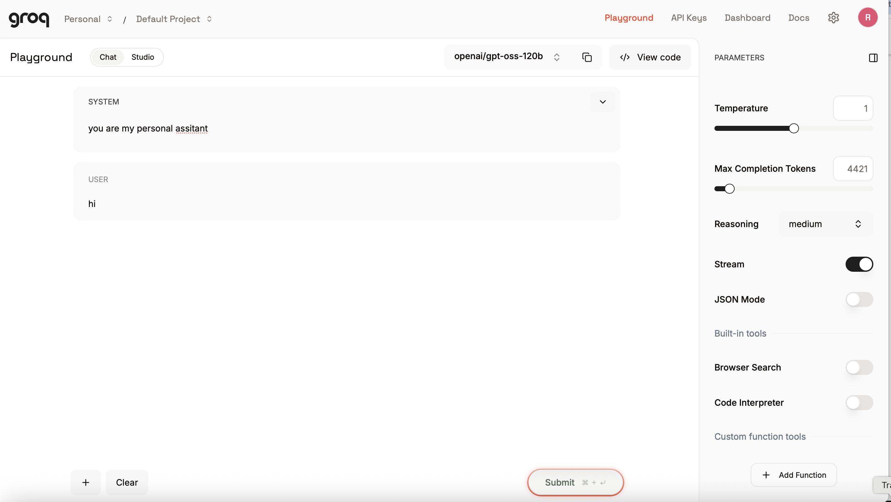
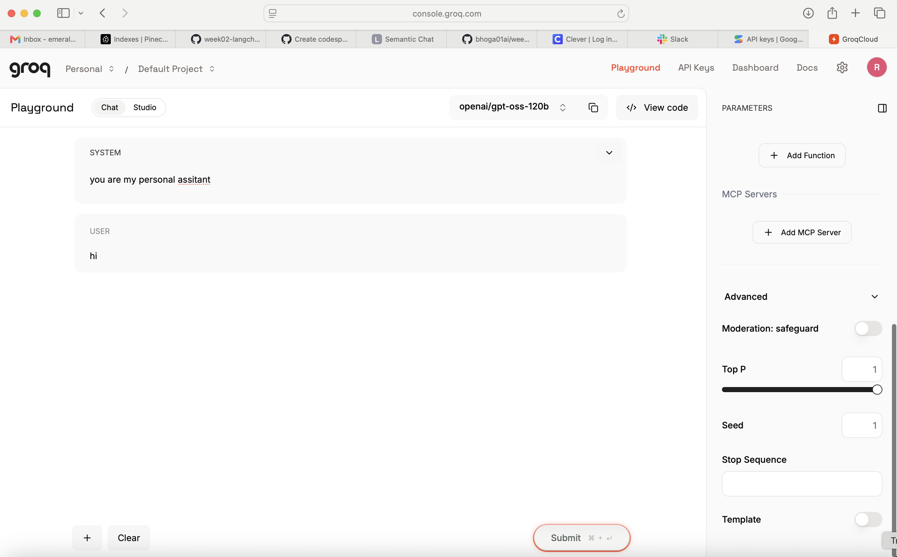
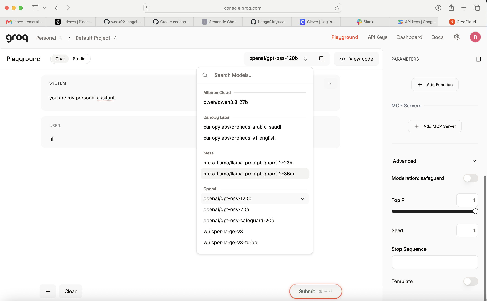

# My Personal Assistant

A local personal AI assistant web app for chatting with your own OpenAI and
Gemini models, using your own API keys.

## Origin

This project started from a brief to build a local web app, titled "My
Personal Assistant", that lets the user chat with either OpenAI or Google
Gemini models using their own API keys, with a Playground-style parameter
panel (temperature, top_p, top_k, max output tokens, seed, stop sequence)
inspired by the attached Groq Console screenshots below. It was to run
entirely on the user's machine, with API keys never leaving the backend
process. (Restated from the [design spec](docs/superpowers/specs/2026-09-24-personal-assistant-design.md);
the original chat prompt itself wasn't retained.)

The referenced Groq Console screenshots that inspired the parameter panel:

<p>
  
  
  
</p>

## Setup

1. Create a virtual environment and install dependencies:
   ```bash
   python3 -m venv .venv
   source .venv/bin/activate
   pip install -r requirements.txt
   ```
2. Copy `.env.example` to `.env` and fill in your API keys:
   ```bash
   cp .env.example .env
   ```
   - Get an OpenAI key at https://platform.openai.com/api-keys
   - Get a Gemini key at https://aistudio.google.com/apikey

   You only need to fill in the key(s) for the provider(s) you plan to use;
   the other provider will show a friendly error if selected without a key.
3. Run the server:
   ```bash
   uvicorn app.main:app --reload
   ```
4. Open http://127.0.0.1:8000/ in your browser.

Your API keys stay in `.env` on your machine and are never sent anywhere
except directly to OpenAI/Google from the backend process.

## Running tests

```bash
python -m pytest -v
```

## Manual smoke test

With both API keys set in `.env`:
1. Start a new chat, leave the system prompt as-is or edit it, select the
   OpenAI provider and send a message — confirm a streamed reply appears.
2. Switch the provider to Gemini on a new chat, adjust Top K, and send a
   message — confirm a streamed reply appears and Top K is visible only
   for Gemini.
3. Restart the server (`Ctrl+C`, then `uvicorn app.main:app --reload` again)
   and reload the browser — confirm both conversations and their full
   message history are still there.

## Project layout

- `app/` - FastAPI backend, providers, persistence.
- `static/` - frontend (HTML/CSS/vanilla JS, no build step).
- `tests/` - pytest test suite.
